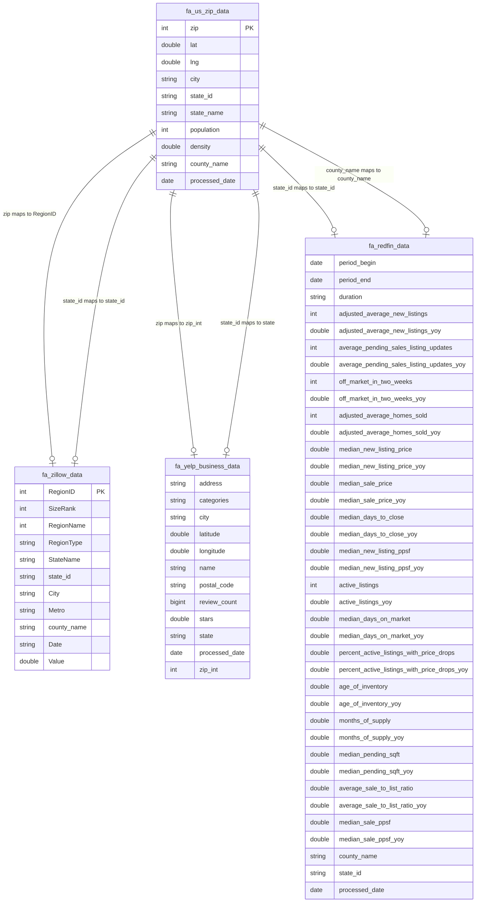

# Neighborhood Insights Dashboard

## Introduction

This project provides an interactive dashboard designed to help users gain comprehensive insights into neighborhoods by analyzing key factors such as home prices, sales trends, and restaurant density and quality. By integrating real estate and restaurant data, the dashboard offers a holistic view of neighborhood dynamics, enabling informed decision-making.

## Scope

The project encompasses the development of a robust data pipeline to ingest, transform, and analyze real estate and restaurant data. Key aspects include:

* **Data Ingestion and Transformation:** Building an automated data pipeline using Databricks Delta Live Tables (DLT) to handle daily and weekly updates.
* **Data Storage:** Storing processed data in Delta tables within Databricks for scalable and efficient querying.
* **Data Analysis:** Performing analytical operations to extract meaningful insights from the integrated datasets.
* **Visualization:** Creating an interactive Tableau dashboard for end-users to explore and filter neighborhood data.

## Design

The core of the project revolves around a Delta table architecture within Databricks, which serves as the data source for the Tableau dashboard. Users can interactively filter and explore neighborhood data based on various criteria, including home prices, sales trends, and restaurant metrics.

### Data Sources

* **[Redfin Dataset](https://www.redfin.com/news/data-center) (TSV ~5 Million):** Provides weekly and monthly real estate market trends.
* **[Zillow Dataset](https://www.zillow.com/research/data/) (CSV):** Offers real estate market data. 
* **[Yelp Dataset](https://business.yelp.com/data/resources/open-dataset/) (JSON ~7 Million):** Contains business data, including ratings, reviews, and locations.
* **[US Zips Dataset](https://simplemaps.com/data/us-zips):** Provides zip code information, latitude, longitude, city, state, population, etc.

### Data Schema



## Tech Stack  
**Data Storage:** Delta Table on Databricks  
**ETL Processing:** PySpark + Databricks DataFrame  
**Orchestration:** Apache Airflow  
**Querying:** Databricks SQL  
**Visualization:** Tableau  

## Data Quality Checks  
- **Missing Values:** Handling missing data in restaurant ratings and property prices.  
- **Duplicate Records:** Removing duplicate entries.  
- **Date Formatting:** Standardizing date formats across Redfin and Yelp datasets.  
- **Location Normalization:** Ensuring consistent neighborhood names for accurate joins.  
- **Data Type Mismatch:** Handling data type mismatch.  
- **Incremental Updates:** Using Databricks MERGE command to manage schema changes and incremental updates.  
- **Databricks DLT:** Using DLT to fetch, unzip, transform, clean, and merge data with zero downtime.  
- **Zillow Date Unpivoting:** Unpivoting the date columns from Zillow to rows.  

## Visualization  
The Tableau dashboard provides a rich set of interactive visualizations:  

### Interactive Filters  
- Filter neighborhoods by median home price ranges.  
- Explore top businesses, including restaurants, based on ratings and reviews.  

### Heatmaps  
- Visualize the density of businesses or population within zip codes using heatmaps.  

### Time Series Trends  
- Track and analyze price changes over time for specific neighborhoods using time series charts.  

## Usage  
### Data Pipeline  
- The data pipeline is automated using **Apache Airflow** and **Databricks DLT**, ensuring regular updates from Redfin, Zillow, and Yelp.  
- **Databricks:** Data is stored and processed in Delta tables within Databricks.  

### Tableau Dashboard  
- **Access** the interactive Tableau dashboard to explore neighborhood insights.  
- **Filtering:** Use the dashboard's filtering capabilities to analyze specific neighborhoods based on your criteria.  
- **Visualizations:** Utilize the heatmaps and time series charts to gain a deeper understanding of neighborhood trends.  

## Data Pipeline Flow  


```mermaid
graph TD
    A[DataSources:
    Redfin / Zillow / Simple Maps / Yelp] --> B[DownloadFiles: Databricks]
    B --> C[ExtractFiles: Databricks]
    C --> D[IngestDataFrames: 
    Databricks DataFrame]
    D --> E[TransformData: 
    Databricks DataFrame]
    E --> F[CreateTable: 
    Delta Table]
    F --> G[InsertMerge: 
    Merge SQL]
    G --> H[DatabricksPipeline]
    H --> I[DeltaTables]
    I --> J[Tableau: Viz]

